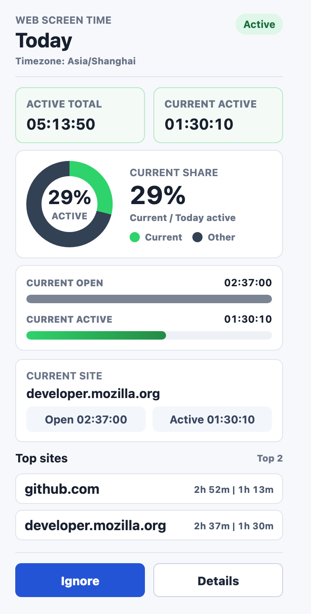
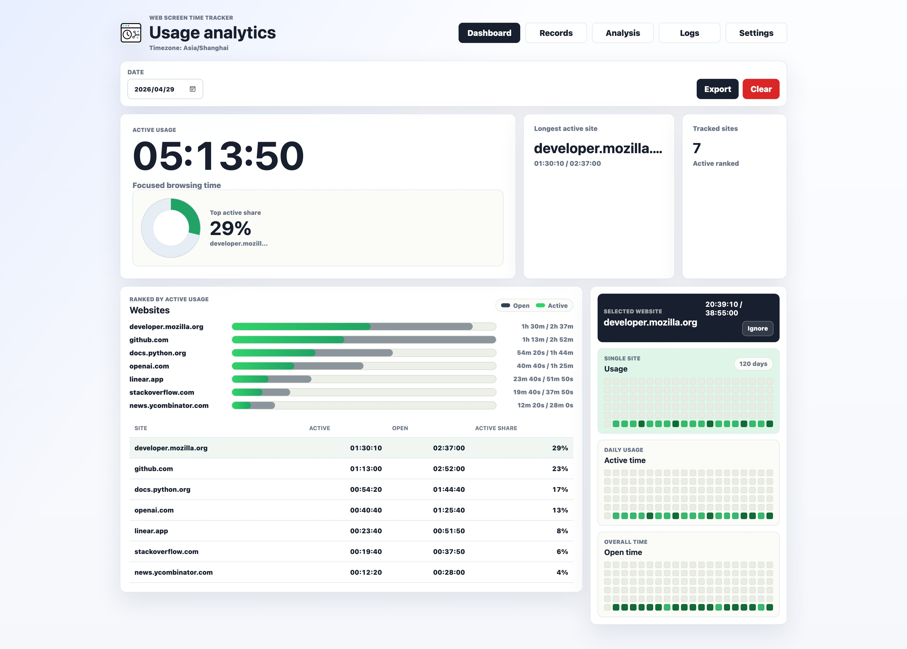
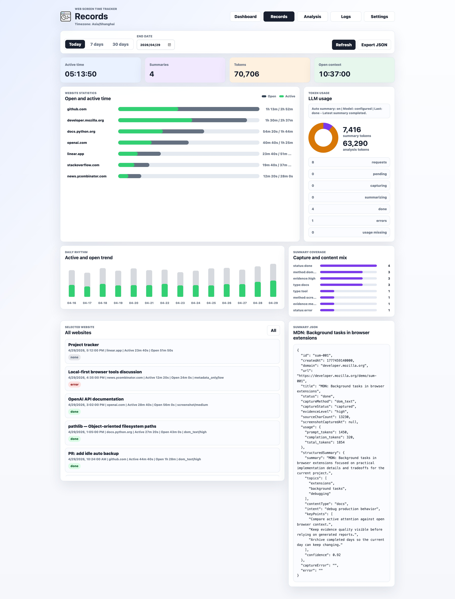
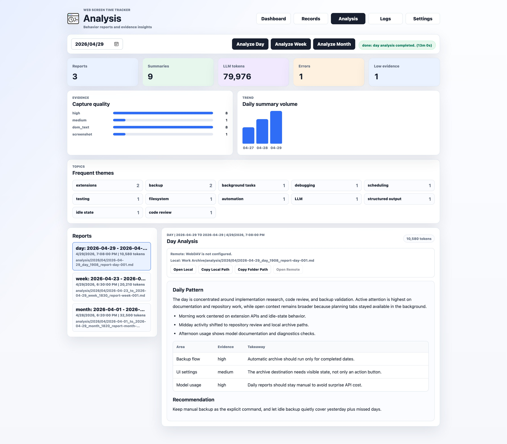
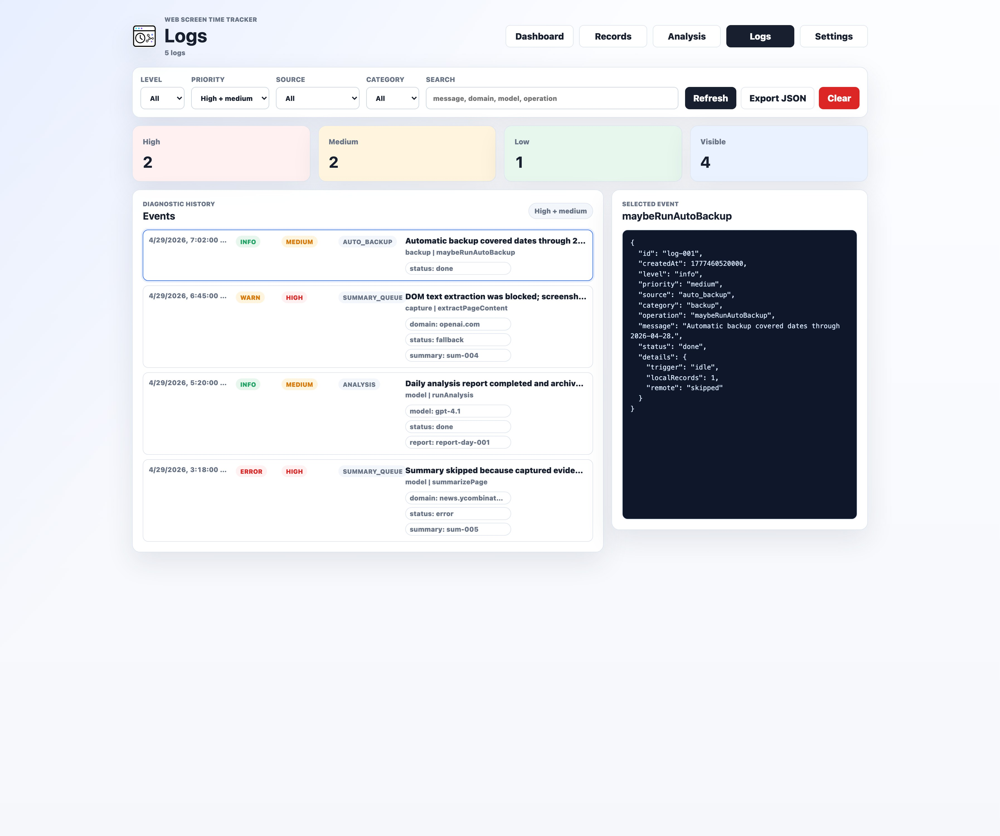
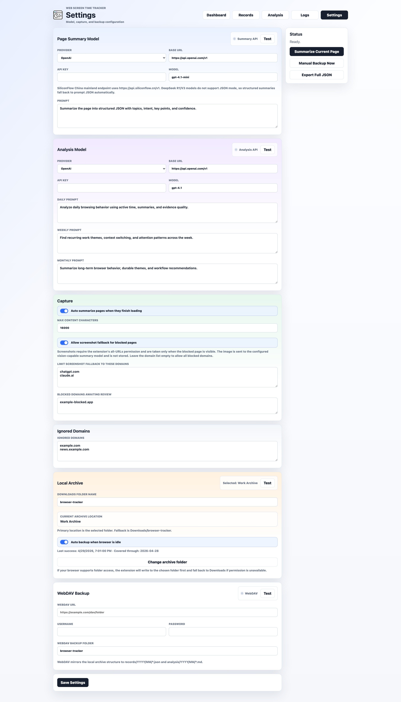

# Web Screen Time Tracker

[中文文档](README.zh-CN.md) | English

Web Screen Time Tracker is a Microsoft Edge / Chromium Manifest V3 extension for tracking browser attention, page visits, AI page summaries, and higher-level behavior reports.

It is built for people who use the browser as a daily workspace: reading, searching, coding, studying, comparing, and making decisions across many tabs. Instead of only counting how long the browser was open, the extension keeps a local browsing timeline and turns selected page activity into summaries and behavior reports.

## Screenshots

One representative screenshot is shown for each primary page. Analysis reports are rendered directly in the browser as Markdown, including headings, lists, tables, inline code, and emphasis. More capture notes are available in [`docs/SCREENSHOTS.md`](docs/SCREENSHOTS.md).

<table>
  <tr>
    <td width="38%" valign="top">
      <strong>Popup</strong><br>
      
    </td>
    <td width="62%" valign="top">
      <strong>Dashboard</strong><br>
      
    </td>
  </tr>
  <tr>
    <td width="50%" valign="top">
      <strong>Records</strong><br>
      
    </td>
    <td width="50%" valign="top">
      <strong>Analysis with Markdown Preview</strong><br>
      
    </td>
  </tr>
  <tr>
    <td width="50%" valign="top">
      <strong>Logs</strong><br>
      
    </td>
    <td width="50%" valign="top">
      <strong>Settings</strong><br>
      
    </td>
  </tr>
</table>

## Core Features

- Active-first browser usage tracking by domain and page.
- Open-context tracking for pages that remain open in the browser.
- Visit timeline with URLs, titles, open/close timestamps, active intervals, and summary status.
- Popup for quick daily awareness.
- Dashboard for active share, open/active comparison, heatmaps, and per-site details.
- Records page for browsing history, summary JSON, model status, and token usage.
- Settings page for provider presets, prompts, API tests, ignored domains, local archive, WebDAV, and export.
- Analysis page for day/week/month behavior reports with in-browser Markdown rendering, evidence charts, trends, and frequent themes.
- Automatic page summaries through OpenAI-compatible chat completion APIs.
- Screenshot fallback for pages where DOM text capture is blocked.
- Local archive for records and analysis reports, with optional WebDAV mirror backup.
- Full local JSON export.

## Active Usage vs Open Context

**Active usage** is the primary attention metric. Time is counted only when:

- the tab is selected
- the browser window is focused
- the device is not locked
- the page is a normal `http` or `https` URL
- the domain is not ignored

**Open context** means a page was open in the browser, but not necessarily receiving attention. It is useful for understanding a single page or website, but it is not used as a primary total because many tabs can be open at the same time.

The extension avoids counting sleep, shutdown, and long browser suspension gaps as open or active time.

## Page Summary Flow

Automatic summarization is non-blocking and separate from time tracking:

1. A normal page finishes loading.
2. The extension creates a pending summary record.
3. The background queue waits briefly for dynamic content to render.
4. DOM text capture is attempted first.
5. If text capture succeeds, the summary model receives page metadata and extracted text.
6. If text capture is blocked and screenshot fallback is enabled, the visible page can be captured and sent to a vision-capable summary model.
7. The result is stored as raw model output plus normalized structured JSON.
8. Token usage is stored when the provider returns `usage`.

Default structured summary shape:

```json
{
  "summary": "string",
  "topics": ["string"],
  "contentType": "article|video|tool|search|social|docs|other",
  "intent": "string",
  "keyPoints": ["string"],
  "confidence": 0.0
}
```

## Blocked Pages and Screenshot Fallback

Some sites, including AI chat apps and highly protected pages, may block `chrome.scripting.executeScript` from reading DOM text. This is a browser/content-security limitation, not necessarily an API key or model problem.

When screenshot fallback is enabled:

- DOM text capture is still tried first.
- Screenshot capture is used only for blocked or low-content pages.
- The screenshot is sent to the configured vision-capable summary model.
- The screenshot is not intentionally kept as a long-term local file after a successful request.
- The page generally needs to be visible for capture to succeed.
- Domains can be restricted in Settings.

For this mode, the configured summary model must support image input. Examples include multimodal models exposed through OpenAI-compatible providers, such as GPT-4o/4.1, Gemini, Claude 3.5/3.7, Qwen VL models, LLaVA, Pixtral, InternVL, or MiniCPM-V, depending on provider availability.

## Analysis Reports

The Analysis page generates day, week, and month reports from:

- daily usage stats
- visit events
- page summaries
- summary evidence levels and capture methods
- model token usage where available

Reports are rendered online in the Analysis page as Markdown and support headings, lists, code blocks, inline code, bold text, and tables. Evidence and trend charts are shown above the report list, and frequent themes are shown as a full-width visual section.

The analysis model can be configured separately from the summary model, so a cheaper model can summarize pages while a stronger model analyzes longer-term behavior.

## Install in Edge or Chromium

Development install:

1. Open `edge://extensions` or `chrome://extensions`.
2. Enable **Developer mode**.
3. Choose **Load unpacked**.
4. Select this project folder.

CRX packaging is possible through the browser extension page's **Pack extension** action. Keep the generated `.pem` private key safe if you want future builds to keep the same extension ID. Do not commit `.crx`, `.pem`, API keys, WebDAV credentials, or exported personal data to GitHub.

For normal user distribution, Edge Add-ons, Chrome Web Store, or enterprise policy distribution is more reliable than manually sharing a CRX file.

## Model Configuration

The extension supports OpenAI-compatible chat completion APIs.

Built-in provider presets:

- OpenAI: `https://api.openai.com/v1`
- OpenRouter: `https://openrouter.ai/api/v1`
- SiliconFlow China mainland endpoint: `https://api.siliconflow.cn/v1`
- SiliconFlow global endpoint: `https://api.siliconflow.com/v1`
- Ollama: `http://localhost:11434/v1`
- Custom endpoint

Notes:

- Summary and analysis models can be configured independently.
- SiliconFlow DeepSeek R1/V3 style models may not support strict JSON mode, so the extension falls back when needed.
- API tests send real requests to verify model connectivity.
- Analysis requests may take longer than summary tests because they include more accumulated data.

## Local Archive and WebDAV Backup

The local archive is the primary file library. WebDAV is an optional remote mirror that uses the same folder structure when configured.

Default local archive path under the browser Downloads folder:

```text
Downloads/browser-tracker/
```

Archive structure:

```text
browser-tracker/records/YYYY/MM/YYYY-MM-DD.json
browser-tracker/analysis/YYYY/MM/YYYY-MM-DD_day_HHMMSS_reportid.md
browser-tracker/analysis/YYYY/MM/YYYY-MM-DD_to_YYYY-MM-DD_week_HHMMSS_reportid.md
browser-tracker/analysis/YYYY/MM/YYYY-MM-DD_to_YYYY-MM-DD_month_HHMMSS_reportid.md
```

Daily record files include daily stats, visit events, page summaries, matching analysis report metadata, timezone, schema version, export timestamp, and sanitized settings. Analysis files are Markdown reports.

The local archive test writes a small nonce file. The WebDAV test performs a real `PUT`, `GET`, and `DELETE` cycle with a nonce payload.

## Permissions

The extension requests broad permissions because it tracks tab state and can summarize pages across domains:

- `tabs`: read tab URL/title and track active tab changes.
- `storage`: store local stats, visits, summaries, settings, and reports.
- `idle`: avoid counting locked or idle device time as active browsing.
- `alarms`: run periodic checkpoints and background queues.
- `scripting`: extract page metadata and DOM text when allowed.
- `activeTab`: access the currently active page after user interaction.
- `contextMenus`: provide right-click ignore actions.
- `notifications`: notify about one-time screenshot fallback behavior or important status.
- `debugger`: capture blocked visible pages when standard screenshot APIs are blocked.
- `<all_urls>`: support tracking and optional summarization across user-visited websites.

The `debugger` permission is used for screenshot fallback on blocked pages. It is not used to remotely debug user activity.

## Privacy

By default, data is stored locally in `chrome.storage.local`.

External data transfer happens only when the user configures related features:

- Page text or screenshot evidence is sent to the configured summary model when summarization runs.
- Aggregated stats, visits, and summaries are sent to the configured analysis model when analysis runs.
- Local archive files are written under the configured archive folder or the browser Downloads fallback.
- Archive mirrors are uploaded only to the user-configured WebDAV endpoint.
- JSON exports can contain private browsing history and page summaries.

API keys and WebDAV credentials are stored in local extension storage. Treat exported data as private.

## Current Limitations

- Screenshot fallback requires a visible page and a vision-capable model.
- Some browser-internal pages and extension pages cannot be summarized.
- Provider behavior differs; not every OpenAI-compatible endpoint supports JSON mode, image input, or token usage reporting.
- Cost depends on model pricing, captured content length, screenshot usage, and summary frequency.
- Schema migration tooling is still a future improvement.

## Project Structure

```text
edge-screen-time-tracker/
├── manifest.json
├── background.js
├── popup/
├── dashboard/
├── records/
├── settings/
├── analysis/
├── utils/
├── assets/
├── docs/
│   ├── assets/
│   ├── screenshots/
│   └── SCREENSHOTS.md
├── README.md
└── README.zh-CN.md
```
