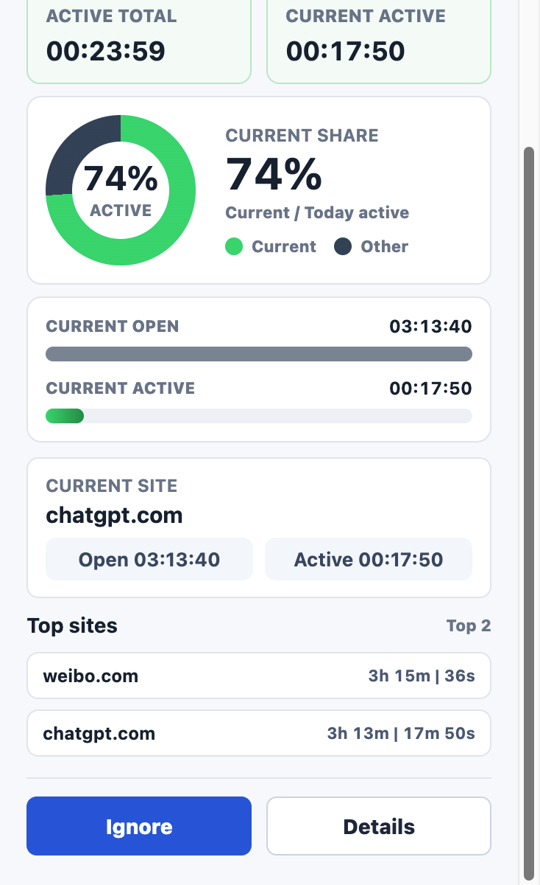

# Web Screen Time Tracker

[中文文档](README.zh-CN.md) | English

Web Screen Time Tracker is a Microsoft Edge / Chromium Manifest V3 extension for recording browser activity, page visits, page summaries, and AI-assisted behavior analysis.

This project was designed and developed through an iterative collaboration between the user and Codex / GPT-5.5. Codex / GPT-5.5 is not a runtime dependency; it was the engineering assistant used to design, implement, review, and refine the extension.

## Why This Exists

A browser is close to a second operating system. Many people read, search, work, study, chat, compare, and make decisions inside browser tabs all day. A simple screen-time tracker can tell you how long the browser was open, but it cannot answer the more useful questions:

- What did I actually look at today?
- When did I read, search, work, drift, or revisit something?
- Which websites received my focused attention?
- Which content themes repeat across days, weeks, and months?
- What patterns can a stronger model discover after enough data accumulates?

This extension started as a browser usage tracker, but the long-term goal is a personal browser memory and behavior analysis system. Time is only one dimension. The more important data is the browsing timeline, page content summaries, repeated topics, and long-term behavioral patterns.

## Screenshots

Only the logo, popup, and dashboard are embedded here to keep the README readable. More screenshots are available in `docs/screenshots/`.

### Popup




### Dashboard


### Records


Additional screenshots:
- Settings: `docs/screenshots/settings.jpeg`

## Core Ideas

### Active Usage

Active usage is the main attention metric. It counts time when:

- the tab is selected
- the browser window is focused
- the device is not locked
- the page is a normal `http` or `https` URL
- the website is not ignored

Active time is used for totals, rankings, shares, and the main popup/dashboard interpretation.

### Open Context

Open context means a page or website was open, but not necessarily receiving attention. It is useful only as context for a single page or website.

For example, if a site was open for 2 hours but active for 8 minutes, that tells us the page was mostly background context. But summing open time across the whole browser is usually misleading, because many tabs can be open at the same time. For that reason, the UI treats open time as a secondary comparison metric, not as a primary usage total.

### Visit Events

`visitEvents` are the raw browsing timeline. They preserve:

- domain
- URL
- title
- open/close timestamps
- active intervals
- summary status
- summary ID

Aggregated charts can change over time, but the visit timeline is the source of truth.

### Page Summaries

`pageSummaries` store model-generated summaries for visited pages. These records are designed for later export and deeper analysis with stronger models.

### Analysis Reports

`analysisReports` store higher-level day, week, and month behavior summaries. These reports use collected browsing stats, visit events, and page summaries as input.

## Implemented Features

- Manifest V3 extension for Microsoft Edge and Chromium browsers
- Popup with active-first daily overview
- Current-page active share of today's active browsing time
- Dashboard with active-first ranking and active share charts
- Open/active comparison bars for individual websites
- Records page for browsing history, Summary JSON, LLM usage, and token usage
- Settings page for summary model, analysis model, prompts, ignored domains, and WebDAV
- Analysis page for day/week/month behavior reports
- Automatic page summary queue
- OpenAI-compatible API support
- Provider presets for OpenAI, OpenRouter, SiliconFlow, Ollama, and custom endpoints
- SiliconFlow compatibility handling, including JSON mode fallback for DeepSeek R1/V3 style models
- Real connectivity tests for summary API, analysis API, and WebDAV
- Token usage capture when the provider returns `usage`
- Full JSON export
- Weekly WebDAV archive backup
- Right-click website ignore action
- In-app ignored domain management
- Local storage with `chrome.storage.local`
- Lock-state detection
- System-timezone date grouping

## Interface Overview

### Popup

The popup is meant for fast awareness:

- today's total active usage
- current page active time
- current page share of today's active time
- current page open/active comparison
- top active sites
- quick ignore action
- link to the full dashboard

### Dashboard

The dashboard is the primary usage visualization page:

- active-focused daily total
- top active site share
- active-ranked website list
- open/active bar comparison per website
- active and open heatmaps
- selected website detail panel

Open time remains visible here because it is useful for a single website comparison.

### Records

Records is the data inspection page:

- website statistics over selected date ranges
- visit list with timestamps
- Summary JSON viewer
- LLM request status
- summary/analysis token usage
- pending/capturing/summarizing/done/error/skipped status counts

By default, the Summary JSON panel shows the latest successful summary. If a user clicks a visit, the panel stays on that clicked item, even if it is failed, skipped, pending, or still summarizing.

### Settings

Settings contains:

- summary model configuration
- analysis model configuration
- editable prompts
- provider presets
- real API tests
- WebDAV configuration and test
- ignored domains
- JSON export
- manual current-page summarization
- weekly backup action

### Analysis

Analysis generates higher-level behavior summaries for:

- day
- week
- month

The analysis model can be configured separately from the page summary model, so a cheaper/faster model can summarize pages while a stronger model analyzes behavior.

## LLM Summary Flow

Automatic summarization follows a non-blocking queue:

1. A normal web page completes loading.
2. The extension creates a `pending` summary record.
3. A background summary queue waits briefly so dynamic content can render.
4. The extension captures title, meta description, headings, and body text.
5. The summary model is called with a fixed JSON schema prompt.
6. The response is stored as both raw text and normalized structured JSON.
7. Token usage is stored if the provider returns it.

The summary queue is separate from the tracking queue. Slow model responses should not block active/open time tracking.

## Default Summary JSON Schema

The summary prompt asks the model to return valid JSON matching this schema:

```json
{
  "summary": "string",
  "topics": ["string"],
  "contentType": "article|video|tool|search|social|docs|other",
  "intent": "string",
  "keyPoints": ["string"],
  "confidence": 0.0
}
```

Field intent:

- `summary`: a concise natural-language summary of the page
- `topics`: short topic labels for future aggregation
- `contentType`: broad page/content category
- `intent`: inferred reason the user may have visited the page
- `keyPoints`: important extracted points
- `confidence`: model confidence from `0.0` to `1.0`

The normalized object is stored as `structuredSummary`.

## Summary Statuses

`pageSummaries` and `visitEvents` use summary states so the UI can show what happened:

- `pending`: summary task was created
- `capturing`: page content is being captured
- `summarizing`: model request is running
- `done`: summary succeeded
- `error`: model/API/unrecoverable failure
- `skipped`: page closed, URL changed, domain ignored, unsupported URL, or content capture blocked

`skipped` is different from `error`. A skipped page is usually not an API failure; it means the extension decided not to summarize or could not safely capture content.

## Storage Shape

The extension stores data in `chrome.storage.local`.

Simplified shape:

```json
{
  "dailyStats": {
    "2026-04-26": {
      "example.com": {
        "activeSeconds": 1800,
        "openSeconds": 5400
      }
    }
  },
  "visitEvents": {
    "2026-04-26": [
      {
        "id": "uuid",
        "domain": "example.com",
        "url": "https://example.com/article",
        "title": "Example Article",
        "openedAt": 1777200000000,
        "closedAt": 1777201800000,
        "openSeconds": 1800,
        "activeSeconds": 600,
        "activeIntervals": [
          {
            "start": 1777200300000,
            "end": 1777200900000,
            "seconds": 600
          }
        ],
        "summaryId": "uuid",
        "summaryStatus": "done"
      }
    ]
  },
  "pageSummaries": {
    "2026-04-26": [
      {
        "id": "uuid",
        "createdAt": 1777201000000,
        "domain": "example.com",
        "url": "https://example.com/article",
        "title": "Example Article",
        "status": "done",
        "model": "model-name",
        "prompt": "summary prompt",
        "summary": "{\"summary\":\"...\"}",
        "structuredSummary": {
          "summary": "...",
          "topics": ["..."],
          "contentType": "article",
          "intent": "...",
          "keyPoints": ["..."],
          "confidence": 0.8
        },
        "usage": {
          "prompt_tokens": 1000,
          "completion_tokens": 200,
          "total_tokens": 1200
        },
        "error": ""
      }
    ]
  },
  "analysisReports": {
    "day": [
      {
        "id": "uuid",
        "createdAt": 1777202000000,
        "period": "day",
        "startDate": "2026-04-26",
        "endDate": "2026-04-26",
        "model": "analysis-model-name",
        "report": "...",
        "usage": {
          "total_tokens": 3000
        }
      }
    ]
  }
}
```

## WebDAV Backup

WebDAV backup is designed around weekly archives instead of uploading after every small change.

Default archive path:

```text
browser-tracker/weeks/YYYY-Www.json
```

Example:

```text
browser-tracker/weeks/2026-W17.json
```

Weekly archive contents include:

- daily stats
- visit events
- page summaries
- analysis reports
- timezone
- schema version
- export timestamp
- sanitized settings

After a day/week/month analysis succeeds, the extension uploads the affected weekly archive files if WebDAV is configured.

The WebDAV test uses real `PUT`, `GET`, and `DELETE` requests with a nonce payload. A green status means the server accepted a real write/read/delete cycle.

## Install in Edge

1. Open `edge://extensions`.
2. Enable Developer mode.
3. Choose **Load unpacked**.
4. Select this folder: `edge-screen-time-tracker`.

## Model Configuration

The extension supports OpenAI-compatible chat completion APIs.

Built-in presets:

- OpenAI: `https://api.openai.com/v1`
- OpenRouter: `https://openrouter.ai/api/v1`
- SiliconFlow: `https://api.siliconflow.com/v1`
- Ollama: `http://localhost:11434/v1`
- Custom endpoint

SiliconFlow note:

- Some DeepSeek R1/V3 style models do not support strict JSON mode.
- The extension automatically avoids or retries without `response_format` when needed.
- Failed model requests show the provider response body where possible.

## Cost Notes

LLM cost depends on:

- model pricing
- prompt length
- captured page text length
- number of automatically summarized pages
- whether the provider reports token usage

Observed sample:

- 18 websites summarized with GLM-5-Air cost about `¥0.1253`.

This is not classified as definitely expensive or cheap yet. It is a real observation and should be tracked. If this pattern scales poorly, cost reduction becomes a product bug/risk.

## Current Issues / TODO

- [ ] LLM cost optimization: 18 websites with GLM-5-Air cost `¥0.1253`; monitor whether this is acceptable at daily/weekly scale.
- [ ] Prompt optimization: current prompts work, but may be longer than necessary and may increase cost.
- [ ] Summary cost strategy: consider same-URL caching, content-change detection, trigger frequency control, and cheaper preprocessing models.
- [ ] WebDAV long-term real-world testing: the test flow and weekly archive exist, but need validation across real WebDAV providers over time.
- [ ] Blocked content capture: sites such as ChatGPT may block `chrome.scripting.executeScript`, causing content capture to fail.
- [ ] More detailed token/cost visualization: break down cost by model, website, date, and summary/analysis type.
- [ ] Data migration strategy: future schema changes should include migration tooling and schema version handling.
- [ ] Prompt quality iteration: improve summary precision, reduce noise, and make long-term behavior analysis more useful.

## Known Limitation: Blocked Pages

Some pages may block extension content capture. When this happens, `chrome.scripting.executeScript` can fail with errors such as `Blocked`.

This is not an API key problem and not necessarily a model problem. It means the extension could not read the page content from the browser context.

Expected handling:

- the visit should still be recorded
- the summary may become `skipped` or `error`
- the UI should show the reason
- no empty content should be sent to the model

## Project Structure

```text
edge-screen-time-tracker/
├── manifest.json
├── background.js
├── popup/
├── dashboard/
├── records/
├── settings/
├── analysis/
├── utils/
├── assets/
├── docs/
│   ├── assets/
│   └── screenshots/
├── README.md
└── README.zh-CN.md
```

## Privacy

Data is stored locally in `chrome.storage.local` unless the user configures WebDAV backup or model APIs.

Important:

- API keys are stored in local extension storage.
- Page content is sent to the configured summary model only when summarization runs.
- Analysis data is sent to the configured analysis model only when analysis runs.
- WebDAV backup uploads archives only to the user-configured WebDAV endpoint.
- Exported JSON can contain private browsing history and summaries.

Do not commit real API keys, WebDAV credentials, or exported personal data.

## Roadmap

- Better prompt templates and lower-cost summary modes
- Better blocked-page classification
- Provider-specific model capability profiles
- More detailed cost dashboards
- Schema migration tooling
- Stronger weekly/monthly behavior pattern analysis
- Better visual design consistency across all extension pages
